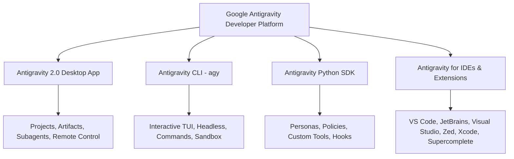

# Google Antigravity Comprehensive Documentation

Welcome to the comprehensive, authoritative documentation suite for **Google Antigravity**—the AI-first developer platform that transforms software engineering through autonomous agents, interactive artifacts, and seamless multi-surface workflows.

---

## 🗺️ Documentation Ecosystem & Sitemap

Google Antigravity is accessible across four interconnected surfaces:

### 1. [Antigravity 2.0 (Core Desktop Application)](core-app/01-getting-started.md)

The primary desktop experience featuring a rich multi-pane interface, real-time diffing, parallel subagent orchestration, and interactive artifacts.

- [01. Getting Started & Installation](core-app/01-getting-started.md) — System requirements, macOS, Windows, Linux downloads, and first session.
- [02. Architecture & Core Features](core-app/02-architecture-and-features.md) — Projects vs Workspaces, Scheduled tasks, Headless mode, and Security.
- [03. Models, Quotas & AI Credits](core-app/03-models-and-quotas.md) — Gemini 3.7 Flash, Gemini 3.1 Pro, Nano Banana Pro, token limits, and billing tiers.
- [04. Asynchronous Subagents & Parallelism](core-app/04-subagents-and-parallelism.md) — Dynamic subagent cloning, isolation modes (branch, share, inherit), and multi-agent communication.
- [05. Artifacts System & Review Workflow](core-app/05-artifacts-and-reviews.md) — Implementation plans, walkthroughs, screenshots, and generative UI widgets.
- [06. Customizations: MCP, Skills, Rules, Hooks, Plugins & Sidecars](core-app/06-customizations.md) — Exhaustive reference for extending Antigravity across all vectors.
- [07. Agent Permissions & Security Engine](core-app/07-permissions-and-security.md) — Declarative rules, cross-platform path resolution, and URL execution controls.
- [08. Remote Control & Headless Daemons](core-app/08-remote-control.md) — Web browser pairing, daemon background service on Linux/macOS.
- [09. Gemini Enterprise & Migration Guides](core-app/09-enterprise-and-migrations.md) — Enterprise admin setup, Agent Platform API, and Firebase Studio migration.
- [10. FAQ & Troubleshooting Guide](core-app/10-faq-and-troubleshooting.md) — Account auth, age verification, region availability, and network proxies.

### 2. [Antigravity CLI (`agy`)](cli/01-getting-started-and-install.md)

The high-performance command-line client built for terminal power users, automation pipelines, and CI/CD environments.

- [01. Installation & Authentication](cli/01-getting-started-and-install.md) — Package managers, OAuth flows, API keys, and `gcli` migration.
- [02. Execution Modes & Sandboxing](cli/02-core-features-and-modes.md) — Interactive TUI, Headless mode, Print mode, and Sandbox execution.
- [03. Slash Commands Reference](cli/03-all-commands-reference.md) — `/agents`, `/codesearch`, `/credits`, `/diff`, `/permissions`, `/resume`, `/statusline`, `/title`, `/usage`, `/voice`.
- [04. CLI Customizations & MCP](cli/04-customizations-and-mcp.md) — MCP configuration (`mcp.json`), plugins, skills, dynamic statuslines, and window titles.
- [05. Background Tasks & Subagent Management](cli/05-subagents-background-tasks.md) — Managing long-running terminal processes and background subagents.
- [06. Configuration & Vim Editor Mode](cli/06-settings-and-vim-mode.md) — `settings.json`, rendering themes, and full modal Vim keybindings.
- [07. CLI Reference & Troubleshooting](cli/07-cli-reference-and-troubleshooting.md) — Complete flags list, environment variables, and debugging tips.

### 3. [Antigravity Python SDK](sdk/01-sdk-overview-and-quickstart.md)

Programmatic agent orchestration library for integrating Antigravity agents into custom applications and enterprise backends.

- [01. SDK Overview & Quickstart](sdk/01-sdk-overview-and-quickstart.md) — Setup, client initialization, and Enterprise Agent Platform integration.
- [02. Personas & Safety Policies](sdk/02-personas-and-policies.md) — Defining agent roles, system instructions, and human-in-the-loop policies.
- [03. Custom Tools, Skills & MCP Integration](sdk/03-tools-and-mcp.md) — Exposing Python functions as tools, tool group filtering, and MCP servers.
- [04. Subagent Delegation & Lifecycle Hooks](sdk/04-subagents-and-lifecycle.md) — Multi-agent orchestration, session persistence, and cost tracking hooks.
- [05. Structured Outputs & Multimodal Inputs](sdk/05-structured-output-and-multimodal.md) — Pydantic schema validation, streaming events, and multimodal data.

### 4. [Antigravity for IDEs & Extensions](ide/01-ide-overview-and-setup.md)

Bring the full power of Antigravity directly into your preferred code editor.

- [01. IDE Overview & Setup](ide/01-ide-overview-and-setup.md) — Architecture of Antigravity in IDEs and connection setup.
- [02. IDE Extensions Guide](ide/02-ide-extensions.md) — Dedicated installation & workflow guides for VS Code, Visual Studio, JetBrains, Zed, and Xcode.
- [03. Supercomplete, Tab Navigation & Review Changes](ide/03-features-and-supercomplete.md) — Next-token prediction, Tab-to-Jump, Side panel chat, and inline diffs.
- [04. Browser Automation & Testing](ide/04-browser-automation.md) — Embedded browser testing, Allowlist/Denylist security, and Chrome profiles.
- [05. IDE Customizations & Settings](ide/05-ide-customizations.md) — Rules, Workflows, MCP, and configuration within IDE environments.

---

## 📦 Raw Scraped Archive

For reference and historical tracking, the raw source markdown files extracted directly from the official documentation are archived under:

- `docs/antigravity/raw/core/` (31 pages)
- `docs/antigravity/raw/cli/` (36 pages)
- `docs/antigravity/raw/sdk/` (8 pages)
- `docs/antigravity/raw/ide/` (25 pages)
