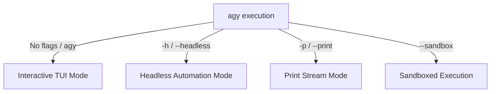

# CLI Execution Modes & Sandboxing

The Antigravity CLI (`agy`) supports multiple execution modes tailored to interactive terminal work, automated scripts, and CI/CD pipelines.

---

## 1. Execution Modes



### 1. Interactive TUI Mode (Default)

Run `agy` inside any project folder:

```bash
agy
```

Opens an interactive terminal user interface featuring multi-line input, slash commands, live streaming agent thoughts, split diff views, and keybindings.

### 2. Headless Mode (`--headless` / `-h`)

Ideal for scripting, automation, git pre-commit hooks, and CI/CD jobs.

```bash
agy --headless "Run unit tests and fix any failing tests in src/auth/"
```

- Runs without user prompts.
- Outputs structured logs and exits with code `0` on success or non-zero on failure.
- Configurable auto-approval of tool permissions via `--auto-approve`.

### 3. Print Mode (`--print` / `-p`)

Outputs direct plain text or JSON output suitable for piping to `jq` or UNIX utilities:

```bash
agy -p "Summarize git diff since main" | glow -
```

---

## 2. Sandbox Execution (`--sandbox`)

To run an agent in an isolated environment where write operations cannot affect your live working tree:

```bash
agy --sandbox "Refactor data models to use TypeScript 5.5 syntax"
```

- Filesystem changes are staged in an ephemeral overlay filesystem or worktree.
- At the end of the session, `agy` presents a summary diff and prompts whether to merge changes into your main repository.

---

## 3. Resuming Sessions (`--resume` / `-r`)

Never lose conversation context. Every `agy` session is saved locally:

```bash
# List and resume recent conversations
agy --resume

# Resume a specific session by ID
agy --resume a5355ff5-b755-4501-8a8f-fb205615e28b
```
