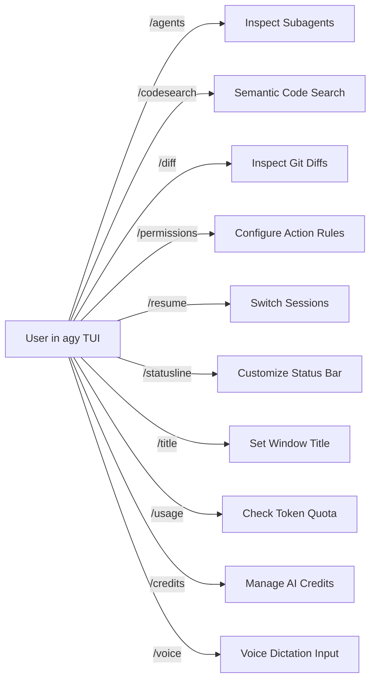

# Antigravity CLI Slash Commands Reference

Antigravity CLI provides powerful interactive slash commands (`/command`) to inspect state, manage agent permissions, search code, adjust quotas, and control UI behavior.

---

## Complete Slash Commands Catalog



---

### 1. `/agents` — Agents Command

Inspect, monitor, and manage active subagents and background tasks.

- **Syntax**: `/agents [list | kill <id> | status]`
- **Examples**:
  ```text
  /agents
  /agents kill subagent-42
  ```

### 2. `/codesearch` — Code Search Command

Perform semantic and regex searches across the codebase using Google indexers.

- **Syntax**: `/codesearch <query>`
- **Example**:
  ```text
  /codesearch "where is JWT token signing implemented?"
  ```

### 3. `/credits` — AI Credits Command

View your current credit balance, renewal date, and billing tier.

- **Syntax**: `/credits`

### 4. `/diff` — Diff Command

View granular inline or side-by-side git diffs of all modifications proposed by the agent.

- **Syntax**: `/diff [file-path]`
- **Example**:
  ```text
  /diff src/components/Button.tsx
  ```

### 5. `/permissions` — Permissions Command

View and update live permission rules for terminal commands, file modifications, and web requests.

- **Syntax**: `/permissions [allow | deny | reset]`

### 6. `/resume` — Resume Command

Browse, search, and switch between previous conversations and sessions.

- **Syntax**: `/resume [conversation-id]`

### 7. `/statusline` — Status Line Command

Dynamically customize the terminal bottom status line tokens (model name, git branch, tokens used, latency).

- **Syntax**: `/statusline <format-string>`

### 8. `/title` — Window Title Command

Set or dynamically template the terminal window tab title.

- **Syntax**: `/title [format-string]`

### 9. `/usage` — Model Quotas & Token Usage

Display real-time token consumption breakdown (prompt tokens, reasoning tokens, output tokens).

- **Syntax**: `/usage`

### 10. `/voice` — Voice Dictation Command

Activate microphone voice-to-text dictation for hands-free prompt input.

- **Syntax**: `/voice [start | stop | config]`
