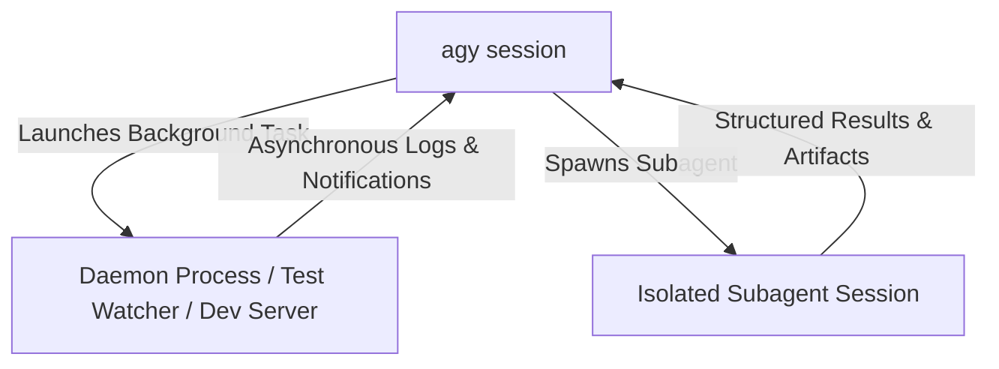

# Background Tasks & Subagent Management in CLI

Learn how to manage background shell tasks, daemons, and parallel subagents from within the Antigravity CLI.

---

## 1. Background Tasks vs. Subagents

| Type                | Nature                           | Primary Use Case                                                                 |
| :------------------ | :------------------------------- | :------------------------------------------------------------------------------- |
| **Background Task** | OS process running in background | Dev servers (`bun dev`), test watchers (`jest --watch`), long-running compilers. |
| **Subagent**        | Autonomous LLM agent instance    | Parallel research, concurrent test generation, multi-repo refactoring.           |

---

## 2. Managing Background Tasks via CLI

Within an `agy` session, the agent can launch and supervise background tasks:

- **`run_command` with `IsDaemon: true`**: Launches a continuous process.
- **`manage_task`**:
  - `list`: Lists all running task IDs, start times, and log file paths.
  - `status`: Checks health and recent stdout/stderr output.
  - `send_input`: Sends stdin input to interactive processes.
  - `kill`: Gracefully terminates background tasks.

---

## 3. Managing Subagents via `/agents`

Use the interactive `/agents` command in the CLI to:

1. View all running subagent conversation IDs and memory usage.
2. Jump directly into a subagent transcript to inspect intermediate reasoning.
3. Pause or cancel runaway subagents.
