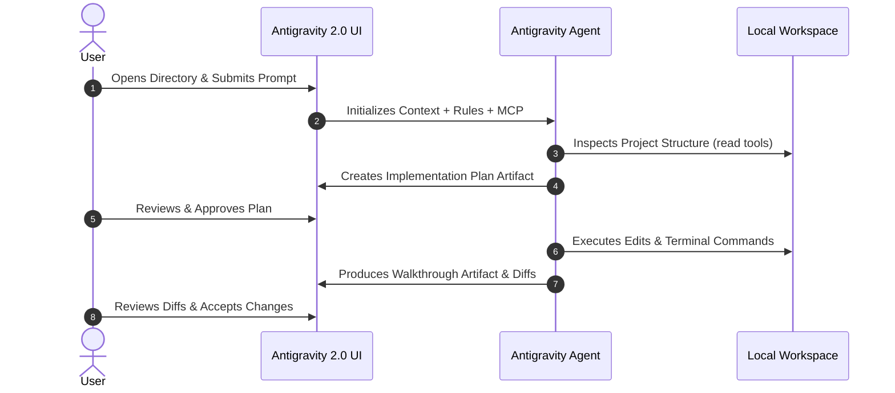

# Getting Started with Antigravity 2.0

Google Antigravity 2.0 is an AI-first software development platform and standalone desktop environment designed for end-to-end agentic pair programming. It unifies autonomous AI agents, rich interactive artifacts, parallel subagent swarms, terminal execution, and intelligent code review.

---

## 1. System Requirements & Downloads

Visit [antigravity.google/download](https://antigravity.google/download) to obtain the official release packages.

| Platform    | Download Packages                                                                                                                                                                                                                                                                                                            | System Requirements                                                                                      |
| :---------- | :--------------------------------------------------------------------------------------------------------------------------------------------------------------------------------------------------------------------------------------------------------------------------------------------------------------------------- | :------------------------------------------------------------------------------------------------------- |
| **macOS**   | • [Download for Apple Silicon (ARM64)](https://storage.googleapis.com/antigravity-public/antigravity-hub/2.5.0-5471848641724416/darwin-arm/Antigravity.dmg)<br>• [Download for Intel (x86_64)](https://storage.googleapis.com/antigravity-public/antigravity-hub/2.5.0-5471848641724416/darwin-x64/Antigravity.dmg)          | macOS 12 (Monterey) or later.<br>Native support for M1/M2/M3/M4 Apple Silicon.                           |
| **Windows** | • [Download for Windows x64](https://storage.googleapis.com/antigravity-public/antigravity-hub/2.5.0-5471848641724416/windows-x64/Antigravity-x64.exe)<br>• [Download for Windows ARM64](https://storage.googleapis.com/antigravity-public/antigravity-hub/2.5.0-5471848641724416/windows-arm/Antigravity-arm64.exe)         | Windows 10 (64-bit) or Windows 11.<br>PowerShell 5.1+ or Windows Terminal recommended.                   |
| **Linux**   | • [Download for Linux x64 (.tar.gz)](https://storage.googleapis.com/antigravity-public/antigravity-hub/2.5.0-5471848641724416/linux-x64/Antigravity.tar.gz)<br>• [Download for Linux ARM64 (.tar.gz)](https://storage.googleapis.com/antigravity-public/antigravity-hub/2.5.0-5471848641724416/linux-arm/Antigravity.tar.gz) | `glibc >= 2.28`, `glibcxx >= 3.4.25`.<br>Compatible with Ubuntu 20.04+, Debian 10+, Fedora 36+, RHEL 8+. |

---

## 2. Installation & Setup

### macOS Installation

1. Mount the downloaded `.dmg` disk image.
2. Drag `Antigravity.app` into your `/Applications` directory.
3. Launch Antigravity from Spotlight (`Cmd + Space`) or Launchpad.
4. _Security Prompt_: If prompted regarding Google authentication, allow the browser verification handoff.

### Windows Installation

1. Run the downloaded installer `.exe`.
2. Follow the setup wizard to configure the desktop shortcut and context-menu integrations.
3. Launch Antigravity from the Start Menu.

### Linux Installation

Extract the `.tar.gz` archive to your preferred application directory and create a symlink:

```bash
tar -xzf Antigravity.tar.gz -C /opt/
ln -s /opt/Antigravity/antigravity /usr/local/bin/antigravity
```

---

## 3. Creating Your First Project

In Antigravity 2.0, a **Project** provides persistent memory, shared context across conversations, custom skills, and workspace rules.

1. **Launch Screen**: Click **New Project** or open an existing directory.
2. **Project Name & Path**: Select your local git repository or working directory.
3. **Model Selection**: Choose your default reasoning model (e.g., **Gemini 3.7 Flash** for rapid agentic iteration or **Gemini 3.1 Pro** for deep architectural planning).



---

## 4. Starting Your First Agent Session

1. Open the **Agent Chat Panel** on the right side.
2. Type a clear, goal-oriented instruction. For example:
   ```text
   Review our authentication flow in src/auth/ and implement OAuth2 refresh token rotation with unit tests.
   ```
3. The agent will enter **Planning Mode**, inspect relevant files, generate an `implementation_plan.md` artifact, and request your feedback before modifying any source code.
4. Once you approve, the agent executes the edits, runs tests, and summarizes the work in a `walkthrough.md` artifact.
