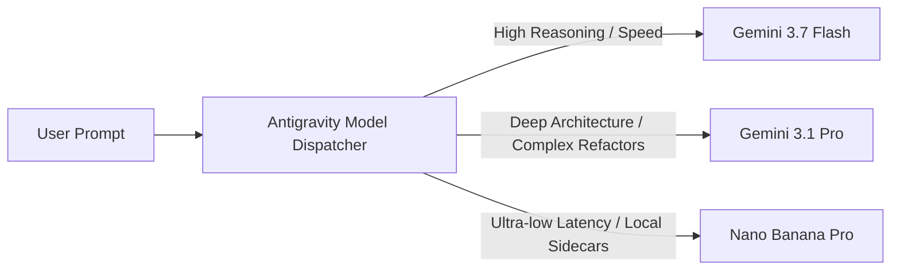

# Models, Quotas & AI Credits

Antigravity 2.0 leverages Google's frontier Gemini reasoning models, optimized specifically for complex software engineering, multi-turn tool calling, and autonomous planning.

---

## 1. Available Frontier Models

### Gemini 3.7 Flash (Default Reasoning Model)

- **Primary Use Case**: Pair programming, multi-step code generation, iterative debugging, and rapid agent tool execution.
- **Reasoning Capabilities**: Dynamic "Thinking" process that articulates chain-of-thought before invoking tools.
- **Context Window**: 1 Million+ tokens for whole-codebase comprehension.

### Gemini 3.1 Pro

- **Primary Use Case**: Deep architectural transformations, extensive code refactoring, complex mathematical proofs, and large-scale repository migrations.
- **Strengths**: Unmatched precision on multi-file dependency analysis and complex algorithm design.

### Nano Banana Pro

- **Primary Use Case**: Ultra-fast inline completions (Supercomplete), Tab-to-Jump navigation, and local sidecar summarization.
- **Latency**: Sub-50ms inference time designed for uninterrupted typing flow.

---

## 2. AI Credits & Quotas System

Usage across Antigravity is managed via the **AI Credits** and Quota infrastructure:

### Plan Tiers

| Plan Tier                 | Target Audience                    | Quota & Credit Allowance                                                                  | Overages Support                                               |
| :------------------------ | :--------------------------------- | :---------------------------------------------------------------------------------------- | :------------------------------------------------------------- |
| **Standard / Individual** | Free tier & individual developers  | Generous daily request quota for Gemini Flash models; baseline credits for Pro reasoning. | Hard cap once daily limits are reached; resets every 24 hours. |
| **Google One AI Premium** | Pro developers & power users       | Expanded priority quotas for Gemini 3.7 Flash & Gemini 3.1 Pro reasoning sessions.        | Flexible credit top-ups available.                             |
| **Gemini Enterprise**     | Teams, enterprises & organizations | Pooled organizational quotas, custom Vertex AI endpoint routing, dedicated SLA.           | Enterprise billing via Google Cloud project quotas.            |

### Monitoring Quota & Usage

You can monitor your current quota balance and token consumption at any time:

- In the desktop application: Navigate to **Settings > Usage & Credits**.
- In the CLI: Run the [`/credits`](../cli/03-all-commands-reference.md#3-credits-ai-credits-command) or [`/usage`](../cli/03-all-commands-reference.md#9-usage-model-quotas) commands.
