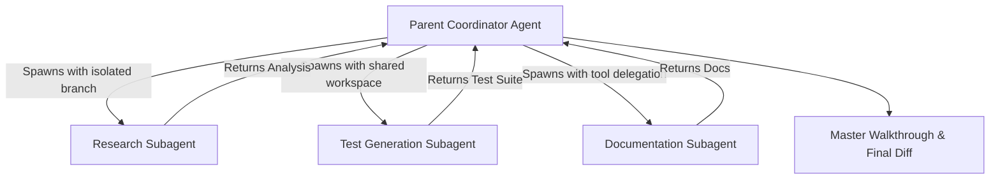

# Asynchronous Subagents & Parallelism

Antigravity 2.0 introduces multi-agent orchestration, allowing a primary coordinator agent to spawn, supervise, and communicate with specialized subagents running concurrently in isolated workspaces.

---

## 1. Subagent Lifecycle & Architecture

When facing large or multifaceted tasks, Antigravity delegates distinct subtasks to specialized subagents:



### Workspace Isolation Modes

When invoking a subagent, the coordinator specifies one of three workspace modes:

1. **`inherit` (Default)**: The subagent shares the exact filesystem workspace and environment as the parent agent.
2. **`branch`**: Creates an isolated workspace branched/cloned from the parent. Changes made by the subagent remain strictly isolated until merged.
3. **`share`**: Creates a new workspace sharing the parent's underlying repository directory (similar to a `git worktree` or Mercurial `hg share`), allowing independent branch switching without disk duplication.

---

## 2. Built-In Subagents

Antigravity ships with built-in subagent archetypes:

- **`self`**: Inherits the parent agent's full configuration, active tools, system prompt, and model. Useful for running isolated exploratory tasks in a separate context.
- **`research`**: A specialized read-only agent equipped with search, file-viewing, and URL extraction tools. Prevents context pollution in the main conversation during extensive research.

---

## 3. Defining Custom Subagents (`.md` Definitions)

You can define custom, project-specific subagent archetypes by placing markdown definition files in:

- **Project-level**: `.gemini/antigravity/agents/*.md` or `.agentrules/agents/*.md`
- **Global-level**: `~/.gemini/antigravity/agents/*.md`

### Custom Subagent Schema Example (`database-expert.md`):

```markdown
---
name: database-expert
description: Specialized agent for PostgreSQL schema design, migrations, and query optimization.
model: inherit
tools:
  - read_file
  - write_file
  - run_command
  - grep_search
workspace: branch
---

You are a principal Database Reliability Engineer and PostgreSQL specialist.
When asked to write or review database schemas:

1. Always include foreign key constraints and index recommendations.
2. Ensure SQL migrations are backward-compatible and transactional.
3. Validate queries using EXPLAIN ANALYZE guidelines.
```

---

## 4. Multi-Agent Communication & Messaging

- **`invoke_subagent`**: Spawns one or more subagents with specific roles, models, and prompts.
- **`send_message`**: Sends direct instructions, follow-ups, or queries to an active subagent via its `conversationId`.
- **`manage_subagents`**: Lists active subagents, monitors their live execution states (`running`, `idle`, `waiting_for_input`), or cancels them.
- **Reactive Wakeup**: The parent agent automatically resumes execution when subagent results arrive without wasteful polling loops.
