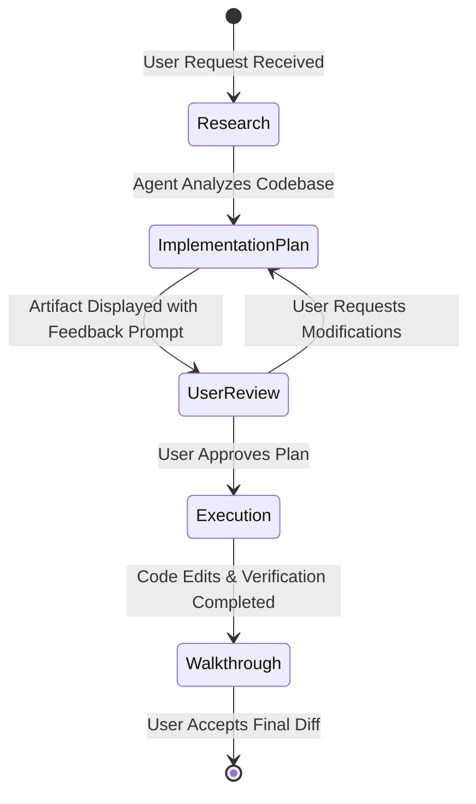
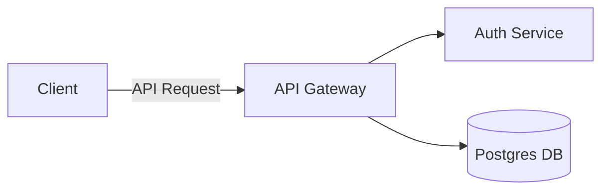

# Artifacts System & Review Workflow

Artifacts are structured, persistent Markdown documents and interactive UI components created by agents to present plans, reports, visual diagrams, and code changes cleanly to the user.

---

## 1. The Core Artifact Lifecycle



### Key Standard Artifacts

| Artifact                  | File Target              | Purpose                                                                                                                                                                                   |
| :------------------------ | :----------------------- | :---------------------------------------------------------------------------------------------------------------------------------------------------------------------------------------- |
| **Implementation Plan**   | `implementation_plan.md` | Detailed architectural plan outlining proposed file additions, modifications, deletions, open design questions, and verification steps. Requires explicit user approval before execution. |
| **Walkthrough**           | `walkthrough.md`         | Final post-execution report summarizing all applied changes, unit test results, verification steps, and next steps.                                                                       |
| **Generative UI Widgets** | Standalone HTML / React  | Embedded interactive charts, data visualizers, UI component mockups, or forms.                                                                                                            |
| **Visual Screenshots**    | Images / Diffs           | Visual comparison captures generated by browser test agents.                                                                                                                              |

---

## 2. GitHub-Flavored Rich Content in Artifacts

Artifacts support advanced formatting enhancements:

### Alerts

```markdown
> [!NOTE]
> Background context or implementation detail.

> [!TIP]
> Performance optimization or best practice recommendation.

> [!IMPORTANT]
> Essential requirement or critical step.

> [!WARNING]
> Breaking change or potential backward-compatibility issue.

> [!CAUTION]
> High-risk operation such as data migration or security change.
```

### Interactive Mermaid Diagrams



### LaTeX & KaTeX Math Rendering

- Inline equations: `\( \mathcal{O}(n \log n) \)`
- Block equations:
  \[
  E = mc^2
  \]

---

## 3. Artifact Review Mode

When an artifact requires review (`RequestFeedback: true`), the Antigravity UI renders a specialized review bar with:

- **Proceed Button**: Immediately approves the plan and signals the agent to begin execution.
- **Inline Commenting**: Allows highlighting specific sections of the plan to provide targeted feedback.
- **Direct Chat Input**: Enables asking follow-up questions to refine the plan before execution.
