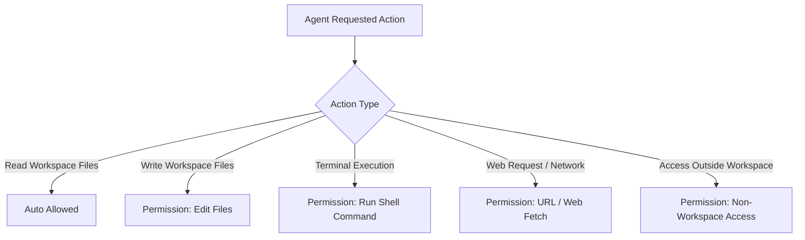

# Agent Permissions & Security Engine

Antigravity operates a granular, rule-based permissions engine designed to balance agent autonomy with security and developer control.

---

## 1. Permission Action Categories

Antigravity classifies agent actions into specific permission scopes:



### Supported Permission Rules

| Action Identifier                     | Description                                                | Default Policy                                       |
| :------------------------------------ | :--------------------------------------------------------- | :--------------------------------------------------- |
| `read_file`                           | Read contents of files inside the workspace directory.     | Auto-approved                                        |
| `write_file` / `replace_file_content` | Create, modify, or delete workspace files.                 | Auto-approved (in Planning Mode after plan approval) |
| `run_command`                         | Execute shell commands in the integrated terminal.         | Configurable: Auto / Ask / Deny                      |
| `read_url`                            | Perform HTTP GET request to read public web documentation. | Auto-approved for approved domains                   |
| `execute_url`                         | Post data or invoke active web endpoints / APIs.           | Requires approval                                    |
| `non_workspace_file`                  | Read or write files outside the repository root.           | Requires explicit approval                           |

---

## 2. Declarative Permission Configuration (`settings.json`)

You can define granular permissions in `~/.gemini/antigravity/settings.json` or `.gemini/antigravity/settings.json`:

```json
{
  "permissions": {
    "terminal": {
      "autoExecute": {
        "allowlist": [
          "bun test*",
          "git status",
          "git diff*",
          "npm run build",
          "cargo check"
        ],
        "denylist": ["rm -rf *", "git push --force*", "curl * | bash", "sudo *"]
      }
    },
    "urls": {
      "allowedDomains": [
        "antigravity.google",
        "*.github.com",
        "*.npmjs.com",
        "bun.sh"
      ]
    },
    "strictMode": false
  }
}
```

---

## 3. Strict Mode vs. Autonomous Mode

- **Autonomous Mode (Default)**: The agent has permission to read files, run safe test commands, and perform plan-approved edits smoothly without interrupting the developer at every step.
- **Strict Mode (`"strictMode": true`)**: Requires manual interactive confirmation for every terminal command, external network call, and non-trivial file modification.
