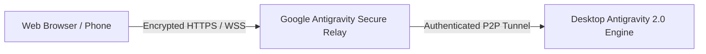

# Remote Control & Headless Daemons

Antigravity Remote Control allows you to securely monitor, control, and pair with your desktop Antigravity sessions from any web browser or mobile device, or run an autonomous headless daemon on remote servers.

---

## 1. Remote Web Pairing

You can access your local Antigravity 2.0 desktop session through a secure, encrypted relay:



### Enabling Remote Web Access

1. Open Antigravity 2.0 and navigate to **Settings > Remote Control**.
2. Toggle **Enable Remote Control**.
3. Scan the generated QR code with your mobile device or open the pairing URL (`https://antigravity.google/remote/<session-token>`).
4. You can now prompt agents, review artifacts, and accept code changes from anywhere.

---

## 2. Remote Control Headless Daemon

For remote development servers, cloud VMs, and CI/CD runners, Antigravity provides a headless daemon service.

### Installation on Linux / macOS

```bash
# Start the Antigravity headless remote daemon
agy daemon start --port 9090 --auth-token-env ANTIGRAVITY_DAEMON_TOKEN
```

### Systemd Service Configuration (`/etc/systemd/system/antigravity.service`)

```ini
[Unit]
Description=Google Antigravity Headless Remote Daemon
After=network.target

[Service]
Type=simple
User=developer
WorkingDirectory=/home/developer/workspace
ExecStart=/usr/local/bin/agy daemon start --headless
Restart=on-failure
Environment=ANTIGRAVITY_LOG_LEVEL=info

[Install]
WantedBy=multi-user.target
```

Enable and start the service:

```bash
sudo systemctl daemon-reload
sudo systemctl enable --now antigravity.service
```
