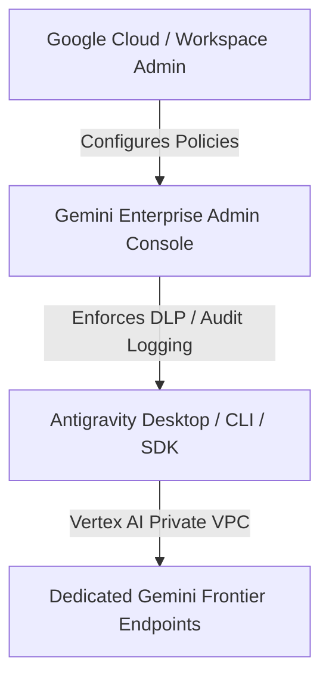

# Gemini Enterprise & Migration Guides

Learn how to configure Antigravity for enterprise organizations, integrate with Google Cloud Vertex AI, and migrate existing projects from Firebase Studio and legacy tooling.

---

## 1. Antigravity in Gemini Enterprise

For enterprise teams, Antigravity integrates with Google Workspace and Google Cloud console policies:

### Key Enterprise Benefits

- **Zero Data Retention for Training**: Enterprise code and prompts are never used to train base foundation models.
- **Dedicated VPC Service Controls**: Keep agent network calls inside private Google Cloud VPC perimeters.
- **Centralized Audit Logging**: Full trajectory export of all agent actions, terminal outputs, and code diffs into Google Cloud Cloud Logging.
- **Pooled Credit Management**: Centrally manage and allocate model quota across engineering divisions.

---

## 2. Firebase Studio Migration Guide

If you are migrating existing projects from Firebase Studio to Antigravity:

### Step-by-Step Migration

1. **Repository Structure**: Antigravity natively supports monorepos, Bun workspaces, and standard git repositories without requiring proprietary cloud project schemas.
2. **Environment Variables**: Copy your `.env.local` or Firebase configurations into standard project `.env` files.
3. **Migrate Rules & Prompts**:
   - Move Firebase Studio system prompts into `AGENTS.md` in your repository root.
   - Convert custom Firebase tools into standard **MCP Servers** or Antigravity **Skills**.
4. **Initialize Project**: Open Antigravity 2.0, click **Open Project**, and select your existing codebase.
