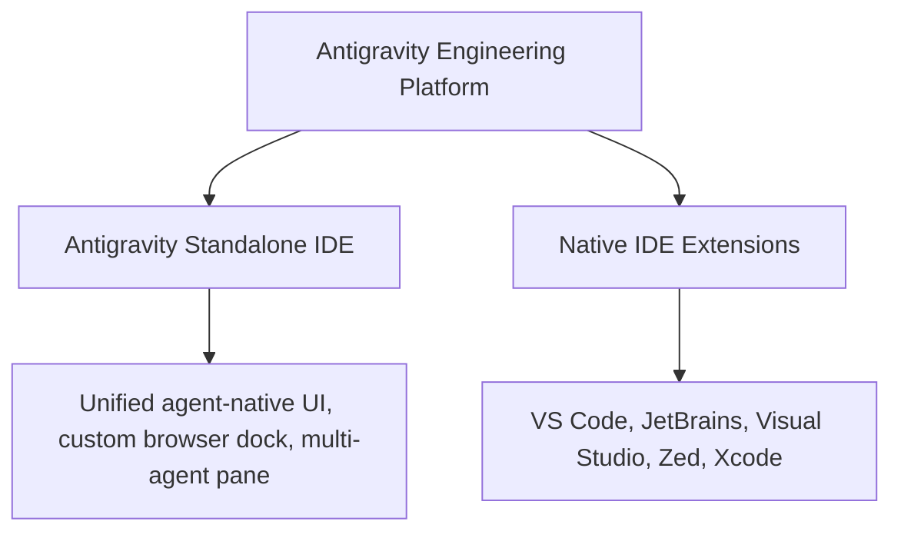

# Antigravity for IDEs: Overview & Setup

Antigravity for IDEs brings Google’s agentic development platform directly into your daily development environment, available both as a **standalone AI-first IDE** and as **native extensions** for all major editors.

---

## 1. Standalone IDE vs. IDE Extensions

| Dimension            | Standalone Antigravity IDE                                                    | Native IDE Extensions                                                             |
| :------------------- | :---------------------------------------------------------------------------- | :-------------------------------------------------------------------------------- |
| **Target User**      | Developers seeking a fully integrated, AI-first pair programming environment. | Developers who want agentic capabilities inside their existing configured editor. |
| **Agent Chat Panel** | Built-in dockable multi-agent canvas.                                         | Dedicated native webview / side panel.                                            |
| **Code Completion**  | Native Supercomplete + Tab-to-Jump.                                           | Editor language server inline completion provider.                                |
| **Artifacts Review** | Dedicated Auxiliary Pane with interactive widgets.                            | Integrated webview preview pane with Proceed buttons.                             |
| **Browser Testing**  | Embedded Chrome sandbox with visual replay.                                   | External Chrome integration via DevTools protocol.                                |
