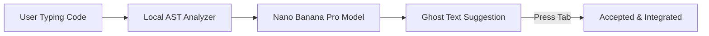

# Supercomplete, Tab Navigation & Review Changes

Explore the AI-powered editing capabilities provided by Antigravity across IDE environments.

---

## 1. Supercomplete (Next-Token & Multi-Line Prediction)

Powered by sub-50ms **Nano Banana Pro** models, Supercomplete anticipates your next coding actions:

- **Full Multi-line Block Generation**: Predicts entire loops, pattern matchers, and error handling blocks.
- **Context-Aware Import Resolution**: Automatically inserts necessary package imports when accepting suggestions.

---

## 2. Tab-to-Jump Navigation

Tab-to-Jump intelligently moves your cursor directly to the next logical location in your code:

- After completing a function signature, press `Tab` to jump directly into the function body.
- After filling parameters in a test case, press `Tab` to navigate to the assertion line.

---

## 3. Review Changes & Inline Diffs

When an agent proposes changes:

- Changes are presented in an inline visual diff directly inside your active editor tabs.
- You can accept individual hunk changes (`Cmd+Y` / `Ctrl+Y`), reject specific lines, or accept the entire file changeset at once.
