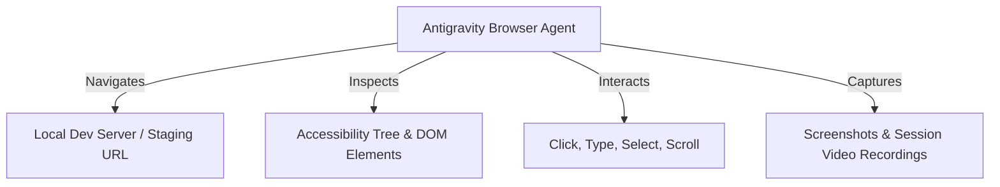

# Browser Automation & Testing in Antigravity

Antigravity includes an autonomous browser agent that can launch web applications, inspect DOM trees, capture screenshots, and record end-to-end interactions.

---

## 1. Browser Agent Capabilities



---

## 2. Security: Allowlist & Denylist Controls

To safeguard user privacy and prevent unapproved web requests:

```json
{
  "browser": {
    "security": {
      "allowlist": [
        "http://localhost:*",
        "http://127.0.0.1:*",
        "*.mycompany.internal"
      ],
      "denylist": ["*.bank.com", "*.payment-gateway.com"]
    }
  }
}
```

---

## 3. Separate Chrome Profile

Antigravity launches automated browser sessions inside an isolated, sandboxed Chrome profile to ensure:

- Your personal cookies, passwords, and browsing history are never accessed.
- Clean-slate session state for deterministic test reproducibility.
