# TanStack Query (React Query v5) Documentation & Reference Index

Comprehensive, production-ready guide to asynchronous state management with **TanStack Query v5** in React and React Native.

---

## 📚 Documentation Sitemap

```mermaid
graph TD
    TQRoot[TanStack Query v5 Reference] --> Hooks[Query & Mutation Hooks]
    TQRoot --> CoreClasses[Core Classes & Caches]
    TQRoot --> Helpers[Helpers & Utilities]
    TQRoot --> ReactNative[React Native & Persistence]
    TQRoot --> Testing[Testing Guide]

    Hooks --> H1[use-query.md: useQuery Options, Statuses & Selectors]
    Hooks --> H2[use-mutation.md: useMutation & Optimistic Updates]
    Hooks --> H3[use-infinite-query.md: useInfiniteQuery & Pagination]
    Hooks --> H4[suspense-hooks.md: useSuspenseQuery & Error Boundaries]
    Hooks --> H5[use-queries.md: useQueries Dynamic Parallel Fetches]
    Hooks --> H6[state-hooks.md: useMutationState, useIsFetching & useIsMutating]
    Hooks --> H7[use-query-client.md: useQueryClient]

    CoreClasses --> CC1[query-client.md: QueryClient Methods & Defaults]
    CoreClasses --> CC2[query-cache-and-mutation-cache.md: QueryCache & Global Error Logging]

    Helpers --> U1[query-options.md: queryOptions Type-Safe Declarations]
    Helpers --> U2[focus-and-online-managers.md: focusManager & onlineManager]
    Helpers --> U3[hydration.md: dehydrate, hydrate & HydrationBoundary]

    ReactNative --> RN1[react-native-integration.md: AppState, NetInfo & Focus Effects]
    ReactNative --> RN2[persistence.md: MMKV Storage & PersistQueryClientProvider]

    Testing --> T1[testing-queries.md: renderHook, Test QueryClient & Isolation]
```

---

## 🗂️ Table of Contents

### 1. Query & Mutation Hooks (`docs/tanstack-query/hooks/`)

- [`useQuery` Reference (`use-query.md`)](hooks/use-query.md) — Query options, `staleTime`, `gcTime`, and status flags
- [`useMutation` Reference (`use-mutation.md`)](hooks/use-mutation.md) — Mutations, optimistic updates, and rollback
- [`useInfiniteQuery` Reference (`use-infinite-query.md`)](hooks/use-infinite-query.md) — Cursor and page-based pagination
- [Suspense Hooks (`suspense-hooks.md`)](hooks/suspense-hooks.md) — `useSuspenseQuery` with guaranteed data types
- [`useQueries` (`use-queries.md`)](hooks/use-queries.md) — Dynamic parallel fetching and combined selectors
- [Global State Hooks (`state-hooks.md`)](hooks/state-hooks.md) — `useMutationState`, `useIsFetching`, `useIsMutating`
- [`useQueryClient` (`use-query-client.md`)](hooks/use-query-client.md) — Direct QueryClient hook access

### 2. Core Classes & Caches (`docs/tanstack-query/core-classes/`)

- [`QueryClient` Methods (`query-client.md`)](core-classes/query-client.md) — `invalidateQueries`, `setQueryData`, `prefetchQuery`, `cancelQueries`
- [`QueryCache` & `MutationCache` (`query-cache-and-mutation-cache.md`)](core-classes/query-cache-and-mutation-cache.md) — Cache subscriptions and global error listeners

### 3. Helpers & Utilities (`docs/tanstack-query/helpers-and-utilities/`)

- [`queryOptions` Helper (`query-options.md`)](helpers-and-utilities/query-options.md) — Reusable, strongly-typed query configurations
- [Focus & Online Managers (`focus-and-online-managers.md`)](helpers-and-utilities/focus-and-online-managers.md) — NetInfo and AppState event binding
- [Hydration & SSR (`hydration.md`)](helpers-and-utilities/hydration.md) — `dehydrate` and `<HydrationBoundary>`

### 4. React Native & Persistence (`docs/tanstack-query/react-native-and-persisters/`)

- [React Native & Expo Integration (`react-native-integration.md`)](react-native-and-persisters/react-native-integration.md) — Mobile lifecycle and focus refetching
- [MMKV Cache Persistence (`persistence.md`)](react-native-and-persisters/persistence.md) — Offline caching and synchronous storage

### 5. Testing & UI Stability Guide (`docs/tanstack-query/testing/`)

- [Testing Custom Hooks (`testing-queries.md`)](testing/testing-queries.md) — Test wrappers, isolated QueryClient, and async assertions
- [Zero-Retry Touch Stability Architecture (`../../e2e/ZERO_RETRY_ARCHITECTURE.md`)](../e2e/ZERO_RETRY_ARCHITECTURE.md) — How `placeholderData: keepPreviousData` prevents React Native touch cancellation during background refetches
